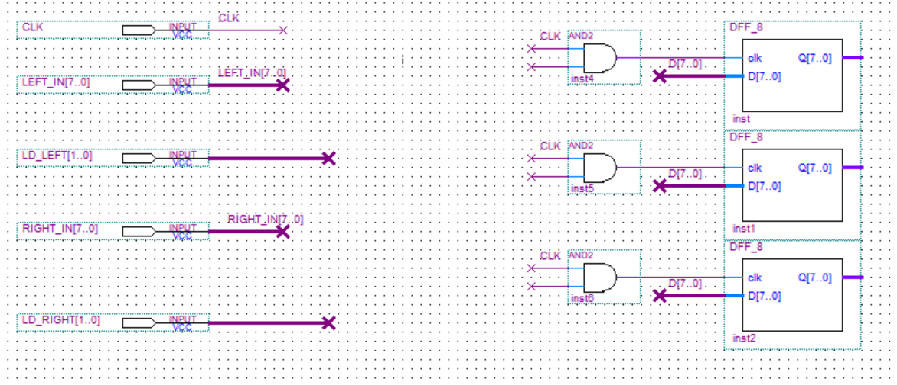

# 8 位 RISC 模型机 状态机控制 双端口

## 从 8 位寄存器（D 触发器）开始

- $D$：8 位输入
- $Q$：8 位输出
- $功能$：上升沿时，将 D 输出给 Q，并保持

```VHDL
library ieee;
use ieee.std_logic_1164.all;

entity DFF_8 is
port(clk:in std_logic;
		  D:in std_logic_vector(7 downto 0);
		  Q:out std_logic_vector(7 downto 0)
		);
end entity;

architecture bhv of DFF_8 is
SIGNAL Q1 : std_logic_vector(7 downto 0) ;
begin
	process(clk,Q1)
	begin
		if clk'event and clk='1' then
			Q1<=D;
		end if;
	end process;
	Q<=Q1;
end bhv;
```

## 寄存器堆

> $双端口$：
> 左入（从 ALU 来） 和 右入（从 CPU 内总线来）；
> 左出（到 ALU 的 A 端口寄存器去） 和 右出（到总线去）
> 

1. 三个寄存器
   
2. 左入端口 和 右入端口
   - $LEFT\_IN$：左入数据
   - $LD\_LEFT$：左入选择写哪一个寄存器
   - $RIGHT\_IN$：右入数据
   - $LD\_RIGHT$：右入选择写哪一个寄存器
     
3. 实现：_VHBL 语言_ 实现寄存器堆根据$LD\_LEFT$选择输入左入，根据$LD\_RIGHT$选择输入右入
   **输入**

   - $LEFT\_IN$：左入数据
   - $LD\_LEFT$：左入选择
   - $RIGHT\_IN$：右入数据
   - $LD\_RIGHT$：右入选择

   **输出**

   - **LD_R0, LD_R1, LD_R2**: 3 个寄存器的选择
   - **D_R0, D_R1, D_R2**: 3 个寄存器的写入数据

```VHDL
library ieee;
use ieee.std_logic_1164.all;

entity IN_SEL is
port(
    LEFT_IN: IN STD_LOGIC_VECTOR(7 DOWNTO 0);
    LD_LEFT: IN STD_LOGIC_VECTOR(1 DOWNTO 0);
    RIGHT_IN: IN STD_LOGIC_VECTOR(7 DOWNTO 0);
    LD_RIGHT: IN STD_LOGIC_VECTOR(1 DOWNTO 0);
    LD_R0, LD_R1, LD_R2: OUT STD_LOGIC;
    D_R0, D_R1, D_R2: OUT STD_LOGIC_VECTOR(7 DOWNTO 0)
	);
end entity;

architecture bhv of IN_SEL is
begin
	process(LD_LEFT, LD_RIGHT, LEFT_IN, RIGHT_IN)
	begin
        -- R0
        IF(LD_LEFT = "00") THEN
            D_R0 <= LEFT_IN;
        END IF;
        IF(LD_RIGHT = "00") THEN
            D_R0 <= RIGHT_IN;
        END IF;

        -- R1
        IF(LD_LEFT = "01") THEN
            D_R1 <= LEFT_IN;
        END IF;
        IF(LD_RIGHT = "01") THEN
            D_R1 <= RIGHT_IN;
        END IF;

        -- R2
        IF(LD_LEFT = "10") THEN
            D_R2 <= LEFT_IN;
        END IF;
        IF(LD_RIGHT = "10") THEN
            D_R2 <= RIGHT_IN;
        END IF;

        IF(LD_LEFT = "00" OR LD_RIGHT = "00") THEN
            LD_R0 <= '1';
        ELSE
            LD_R0 <= '0';
        END IF;
        IF(LD_LEFT = "01" OR LD_RIGHT = "01") THEN
            LD_R1 <= '1';
        ELSE
            LD_R1 <= '0';
        END IF;
        IF(LD_LEFT = "10" OR LD_RIGHT = "10") THEN
            LD_R2 <= '1';
        ELSE
            LD_R2 <= '0';
        END IF;

	end process;
end bhv;
```


4. **_或者_** 使用 **选择器、与非门等硬件** 实现：实现寄存器堆根据$LD\_LEFT$选择输入左入，根据$LD\_RIGHT$选择输入右入
   > 实现方式：
   > 先用 24 译码器 **lpm_decode** 译码两个选择信号 **LD**
   > 将对应寄存器的选择信号相 **或** 接入寄存器
   > 用数据选择器，使用对应的 **LD_LEFT** 选择 **RIGHT_IN\[7..0]** 和 **LEFT_IN\[7..0]**，使对应数据输入到寄存器


5. 实现根据 **SEL_LEFT\[1..0]** 和 **SEL_RIGHT\[1..0]** 选择左出和右出
   > 当 **SEL_LEFT\[1..0]** 或 **SEL_RIGHT\[1..0]** 为 $11$ 时，不选择任何输出，可以用与非门接到三态门上，使用 SEL 信号控制三态门，节省两个 BUS 控制信号

- 使用 VHDL 实现左入和右入原理图为 REG1：
  
  仿真：验证左入和右入，左出和右出
  都正确
  

- 使用硬件实现实现左入和右入原理图为 REG2：
  
  仿真验证正确
  

## ALU 设计

> 双端口：
> A 端口数据寄存器 DR0 从 寄存器堆 REG 的 左出端口 LEFT_OUT 读数据
> B 端口数据寄存器 DR1 从 总线读数据
> ALU 运算结果 直接存入寄存器堆，不经过总线
> 

### ALU181

根据你们的指令集，这里只有加法，减法，左移 1 位，共三种运算
**输入：**

- A：A 端口数据
- B：B 端口数据
- S：运算类型，00 表示不做运算，01 为 ADD，10 为 SUB，11 为 SLL
  **输出：**
- F：运算结果

```VHDL
LIBRARY IEEE;
USE IEEE.STD_LOGIC_1164.ALL;
USE IEEE.STD_LOGIC_UNSIGNED.ALL;
ENTITY ALU181 IS
PORT (
    A,B  : IN  STD_LOGIC_VECTOR(7 DOWNTO 0);
    S  : IN  STD_LOGIC_VECTOR(1 DOWNTO 0 );
    F  : OUT STD_LOGIC_VECTOR(7 DOWNTO 0)
  );
END ALU181;
ARCHITECTURE behav OF ALU181 IS
SIGNAL A9,B9,F9 : STD_LOGIC_VECTOR(8 DOWNTO 0);
BEGIN
A9 <= '0' & A ;  B9 <= '0' & B ;
PROCESS(A9,B9)
BEGIN
CASE S  IS
		WHEN "00" => NULL;
        -- ADD
		WHEN "01" => F9<= A9 + B9;
        -- SUB
		WHEN "10" => F9<= A9 - B9;
        -- SLL
        WHEN "11" => F9(7 DOWNTO 0)<= A9(6 DOWNTO 0) & "0";
		WHEN OTHERS  =>F9<= "000000000" ;
END CASE;
END PROCESS;
    F<= F9(7 DOWNTO 0);
END behav;
```

仿真验证正确


### ALU 部件设计

- IN_A：A 端口输入数据，从寄存器堆左出 **LEFT_OUT** 来
- IN_B：B 端口输入数据，从 **总线** 来
- ALU_OUT：运算器计算结果，输出到寄存器堆 **LEFT_IN**
  

仿真验证正确


## PC 程序计数器

- lpm_counter：PC 计数器
- LD_PC、INC_PC、D\[7..0]：当 LD_PC 和 INC_PC 为 1 时，将 D\[7..0]写入 PC，用于 JMP 跳转指令
- CLR_PC：清零 PC，置 PC=0
- PC_B：允许 PC 输出到总线上


仿真验证


## STEP 时序发生器

直接用老师的文件


## RAM 内存设计

- AR_CLK：地址寄存器 AR 时序输入
- RAM_CLK：读取存储器 RAM 时序输入
- LD_AR：AR 写选通
- W/R：RAM 读写控制，低电平读，高电平写
- RAM_B：存储模块写总线控制，高电平输出到总线


## 控制器设计

这里我就不用微程序实现了，直接采用状态机实现，最简单明了

### 指令集

指令格式
**用你们的指令格式稍作调整**，将 RD 和 RS 的位置互换

| 指令 | 7-4 位 | 3-2 位    | 1-0 位    |
| ---- | ------ | --------- | --------- |
| 功能 | 操作码 | RD 寄存器 | RS 寄存器 |

你们有 IN、SUB、STA、MOV、ADD、OUT、SLL、JMP 共 8 个指令，我这里取部分指令重点演示双端口

| 指令 | 作用         | opcode | rd  | rs  |
| ---- | ------------ | ------ | --- | --- |
| IN   | 用于数据输入 | 0000   | rd  | 11  |
| ADD  | 双端口加法   | 0101   | rd  | rs  |
| SUB  | 双端口减法   | 0010   | rd  | rs  |
| JMP  | 指令跳转     | 1000   | rd  | 11  |

> rs 为 11 代表没有使用任何寄存器

### 流程图

流程图上相同状态，标上同一个状态序号


### 状态信号控制表

根据流程图中，每个状态标出其控制信号：

> 例如 **PC->AR** ：
> PC 的值要输出到 BUS 上，所以 PC_B 要置 1 打开
> AR 要从总线读 PC 的值，所以 LD_PC 要置 1
> **表中，大部分控制信号默认为 0，以表示不作用；但寄存器堆中 2 个 LD 和 2 个 SEL 是默认为 11，以表示不作用**

表中(左)和(右)表示左出左入和右出右入


### 状态图

画出状态图，标出每个状态之间转换需要的条件，没标表示无条件，


### 写状态机控制的 VHDL 代码

写了注释了，可以自己读懂的，跟 C 语言有点像

```VHDL
library ieee;
use ieee.std_logic_1164.all;
use ieee.std_logic_unsigned.all;

entity SM is
	port(
		CLK	 : in	std_logic; -- 时钟信号
        I    : in	std_logic_vector(7 downto 0); -- 指令
		RST	 : in	std_logic; -- 复位信号
		CTL	 : out	std_logic_vector(18 downto 0)); -- 控制信号
end entity;

architecture rtl of SM is
	-- 这里写下所有的状态
	type state_type is (s0, s1, s2, s3, s4, s5, s6);
	signal state   : state_type;

begin
    -- 这个进程控制状态机的状态转移有关，需要用到信号CLK、RST、I
	process (CLK, RST, I)
	begin
        -- 如果复位信号为1，则状态机回到初始状态
		if RST = '1' then
			state <= s0;
        -- 如果时钟信号为上升沿，则状态机状态转移
		elsif (rising_edge(CLK)) then
			case state is
				when s0=>
                    -- 初始状态下，状态机转移到s1
					state <= s1;
				when s1=>
                    -- 如果指令的高四位为0000，则状态机转移到s2
                    -- 如果指令的高四位为0101或0010，则状态机转移到s3
                    -- 如果指令的高四位为1000，则状态机转移到s6
                    -- 后面的状态转移同理
					if (I(7 downto 4) = "0000") then
						state <= s2;
					elsif (I(7 downto 4) = "0101" or I(7 downto 4) = "0010") then
						state <= s3;
                    elsif (I(7 downto 4) = "1000") then
                        state <= s6;
					end if;
				when s2=>
                    state <= s0;
				when s3 =>
					if I(7 downto 4) = "0101" then
                        state <= s4;
                    elsif I(7 downto 4) = "0010" then
                        state <= s5;
					end if;
                when s4 =>
					state <= s0;
                when s5 =>
                    state <= s0;
                when s6 =>
                    state <= s0;
			end case;
		end if;
	end process;

	-- 这个进程控制状态机的输出CTL，需要用到信号state和I
    -- 根据状态机的状态，输出对应的控制信号，控制信号来源于信号控制表的每一行
	process (state, I)
	begin
		case state is
			when s0 =>
                -- s0状态下，输出对应的控制信号,就是表的第一行，以此类推
				CTL <= "0111111110001000110";
			when s1 =>
				CTL <= "0111111110000010001";
			when s2 =>
                -- 表的第三行，注意这里的RD用I(3 downto 2)即指I的第4、3位代替，以此类推
				CTL <= "111"& I(3 downto 2) &"11110000000000";
			when s3 =>
				CTL <= "01111"& I(3 downto 0) &"1000000000";
            when s4 =>
                CTL <= "0"& I(3 downto 2) &"1111110010000000";
            when s5 =>
                CTL <= "0"& I(3 downto 2) &"1111110100000000";
            when s6 =>
                CTL <= "0111111"& I(3 downto 2) &"0000001100";
		end case;
	end process;
end rtl;
```

仿真


### 控制器，加上指令寄存器 IR 就做好了


仿真


## 测试指令设计

### 设计

我这里用上面提到的四个指令设计如下测试指令


### 写入 RAM 内存中

1. 新建 mif 文件
   

2. 右键表头，将两个选项都选 Hex
   

3. 对照测试指令，将指令按地址写入到 mif 文件中
   这个 mif 文件每个格子代表一个内存单元，地址从左往右、从上到下，为 00 一直到 FF
   

4. 将文件绑定到 RAM 的 lpm_ram_dq 上
   1、右键 lpm_ram_dq，编辑
   
   2、双击它
   
   3、next 两次，选择初始化文件
   
   4、finish 后，两个弹窗选确定，然后选否
   5、更新元件
   
   6、设置顶层，编译
   最后再仿真验证，确认指令已经存入，以及 RAM 的读取功能正确
   

## 整机设计

分别将 REG, ALU, PC,RAM,CTL,STEP 者几个部件生成为元件

> 步骤：设置顶层->编译->file->create/updata->create symbol...
> 

然后将这几个部件放到新的空原理图中，分别接上 CLK、RST、D\[7..0]和 Q\[7..0]接总线
其它的控制信号根据控制信号表，接上 CTL\[?..?]


最后仿真验证整机执行测试程序是否正确

1. 指令 IN R0 正确，R0=0A
   
2. 指令 IN R1 正确，R1=05
   
3. 指令 SUB R0,R1，正确，R0=05
   
4. 指令 ADD R0,R1，正确 R1=0A
   
5. 指令 JMP R2，正确，PC=0，下一条指令从地址 00 开始执行
   

#### 80%已完成，需要

1. 将剩下 4 条指令类型加入到流程图
2. 画状态转移图
3. 写信号控制表
4. 改状态机 SM.vhd 的 VHDL 代码，设置顶层、编译、生成部件、刷新顶层原理图中的 CTL
5. 再设计测试程序，使之包含所有指令类型，并绑定入 ram 中，设置顶层、编译、生成部件、刷新顶层原理图中的 RAM
6. 顶层设计图再仿真
